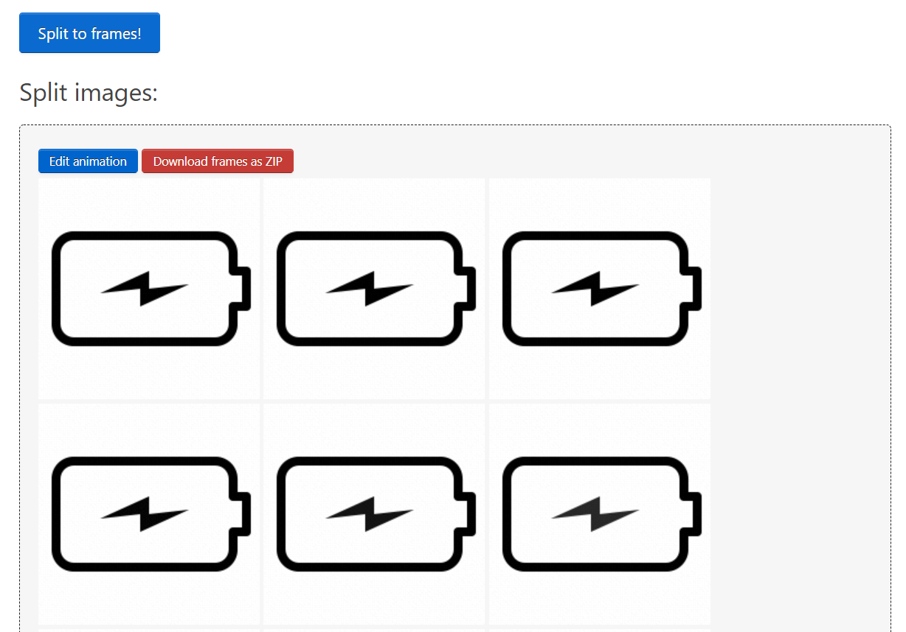
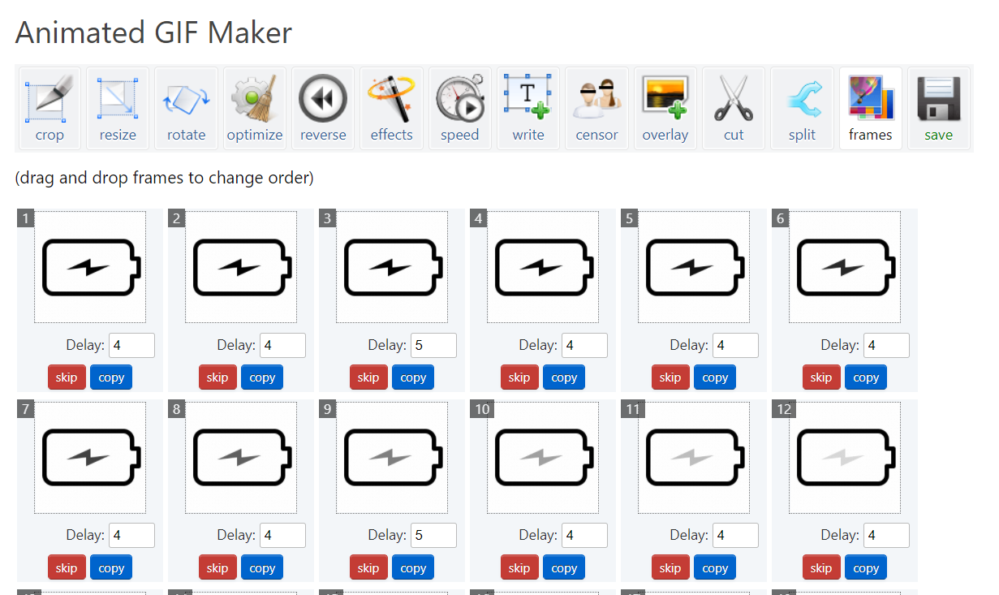
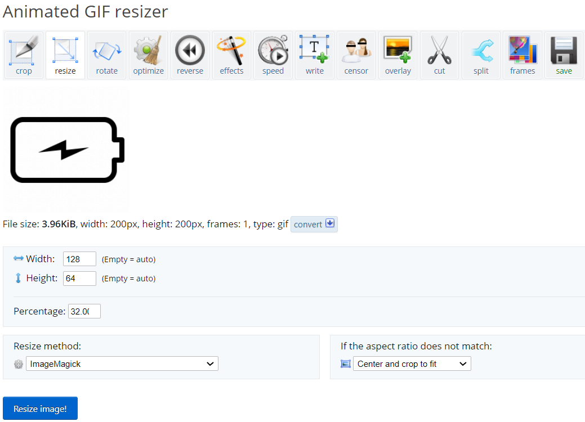
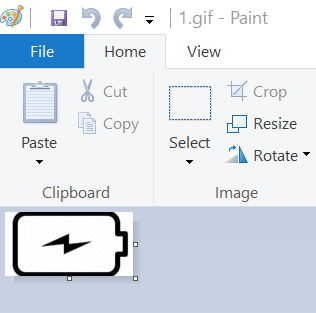
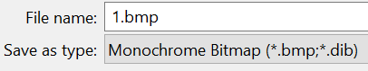
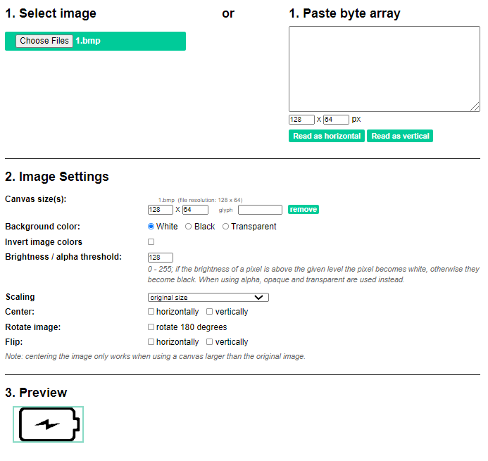
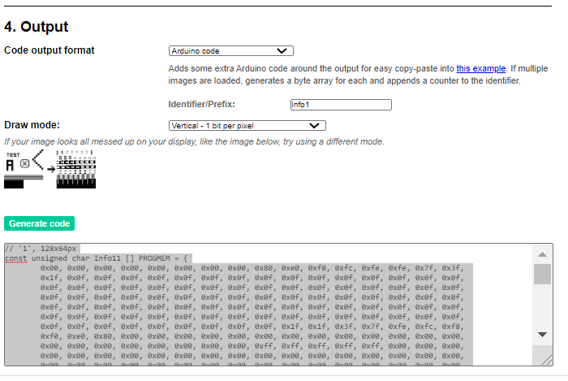
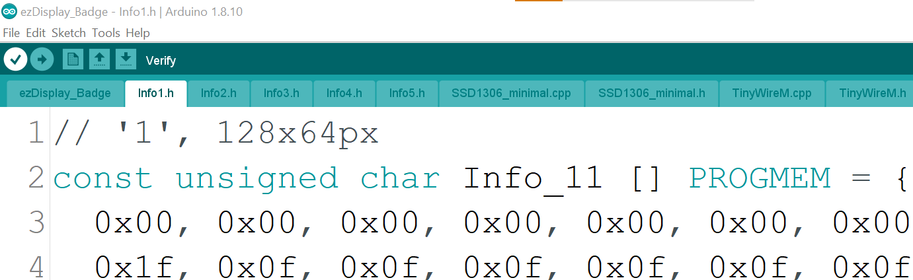
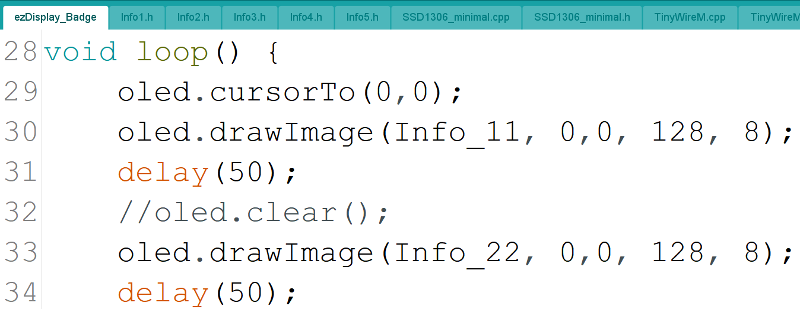

# ezDisplay powered by VK Electronics

_**Repo structure:**_

 example  
 ├── ezDisplay_Badge (Arduino sample code) 
 └── bitmap_samples (BMP format images used for sample)

**Steps and Tools used:**
1. Search for the GIF you want to display: https://icons8.com/free-animated-icons/charging-battery
   
   
2. Convert GIF to frames of images: https://ezgif.com/split
   
   * Split the downloaded GIF into the respective frames of images:
   
   
   * You can customize the animation using the GIF Maker:
   
   
3. Resize the frames of images to size of OLED (128 x 64 pixels): https://ezgif.com/resize
   

4. Convert image extesion to BMP: Paint software 
   * Load the GIF image on **Paint** software 
   
   
   * Choose the file extension as Monochrome BMP:  
     

5. Convert the images into bytes arrays for Arduino code use: https://javl.github.io/image2cpp/ 
   * Load the converted BMP image and change the configurations (as your own preference - trials and errors)
     
     
   * Generate the byte arrays code. One image correspond to one **Identifier/Prefix:**
     
     
   * Paste the generate byte arrays code into the Arduino code (Info1.h or Info2.h or Info3.h .....) in *sample* folder
     
     
   * Change the sequence and name of the *drawImage* function on Arduino main code
     
     

*Demo*:

https://user-images.githubusercontent.com/3338753/126266203-f6aac0b2-3e78-4521-9fda-b27abc24194b.mp4

Product Review by Johnson Lam, Founder of KakiDIY

