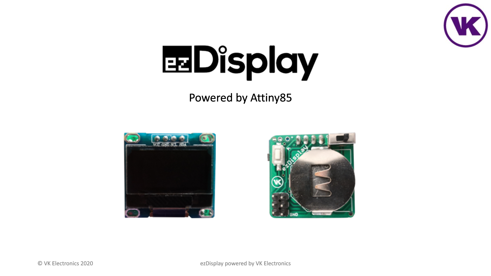

# ezDisplay powered by VK Electronics

**Tools used:**
1. Convert GIF to frames of images: https://ezgif.com/split
2. Resize the frames of images to size of OLED (128 x 64 pixels): https://ezgif.com/resize
3. Convert image extesion to BMP: Paint software ![paint] (https://www.google.com/url?sa=i&url=https%3A%2F%2Fwww.kindpng.com%2Fimgv%2FiJxmbJm_photo-paint-corel-icons-paint-computer-microsoft-clipart%2F&psig=AOvVaw33iPH554-NGUoheU3pnWlT&ust=1626844044604000&source=images&cd=vfe&ved=0CAsQjRxqFwoTCLDegsXw8PECFQAAAAAdAAAAABAR)

